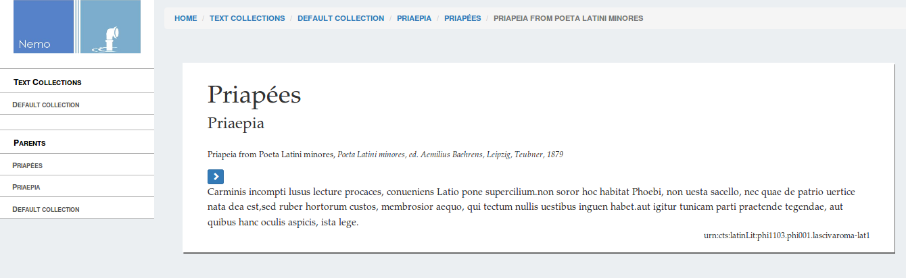

Setting up a simple Nemo and Nautilus application
===

Now that you have the data and the virtual environment prepared, we can start building an application !

## Introduction

A Nemo application is built upon two component : a [Flask application](http://flask.pocoo.org) and a [MyCapytains Resolver](http://mycapytain.readthedocs.io/en/latest/MyCapytain.classes.html#resolvers). Flask being the dependancy of Nemo and Nautilus, it was automatically installed by `pip` when you set up your environment.

We will write the content of this application in `app.py`.

The very first thing we will do is actually set up your flask object : 

```python
from flask import Flask

flask_app = Flask("Flask Application for Nemo")
```

We didn't do much but that's about it. We just needed to set up an application and gave it a name that made sense. The first argument of `Flask()` instantiation is the name of the application. 

We'll just add a command to help flask run at the end of the file : 

```python
if __name__ == "__main__":
    flask_app.run(debug=True)
```

For python, this means that if the current file is the one run, it will execute the `flask_app.run(debug=True)` that will provide us a small development server.

We can now run this application doing `python app.py`. Of course, for now, there is not so much to see though...

### Step 1 - app.py

```python
from flask import Flask

flask_app = Flask("Flask Application for Nemo")

if __name__ == "__main__":
    flask_app.run(debug=True)
```

## Setting up the data retrieval

As we said, Nemo is gonna need a resolver. A resolver in MyCapytain is set up through the python code :

```python
from MyCapytain.resolvers.cts.local import CtsCapitainsLocalResolver

# A resolver takes a list of directories as their first argument which contains Capitains compatible corpus
resolver = CtsCapitainsLocalResolver(["corpora/additional-texts", "corpora/priapeia"])
```

But in the context of a web app and for scaleability reasons, we highly recommend using the [Nautilus resolvers](http://capitains-nautilus.readthedocs.io/en/latest/Nautilus.API.html#resolvers). This will provide cache options that were not included in the MyCapytain implementation (which is thought for local use more than web reuse).

The code is quite similar as Nautilus Resolvers are other implementations of the MyCapitain ones (the technical term is subclasses) :

```python
from capitains_nautilus.cts.resolver import NautilusCTSResolver

resolver = NautilusCTSResolver(["corpora/additional-texts", "corpora/priapeia"])
resolver.parse()
```

We need to say to the application that it needs to parse the corpora. Hopefully, given the small size of our corpora, it will not take long.

The current application file should now look like 

### Step 2 - app.py
```python
from flask import Flask
from capitains_nautilus.cts.resolver import NautilusCTSResolver

flask_app = Flask("Flask Application for Nemo")
resolver = NautilusCTSResolver(["corpora/additional-texts-", "corpora/priapeia"])
resolver.parse()

if __name__ == "__main__":
    flask_app.run(debug=True)
```

## Setting up Nemo

We finally have the two major components of Nemo : a resolver and a Flask object ! We can now set up nemo using those only two objects !

Nemo objects are imported through 

```python
from flask_nemo import Nemo
```

The setup of Nemo needs few basic parameters :
- The `name` of the Nemo instance. Usually you can only put "Nemo" here if you do not have multiple instances of Nemo;
- the `resolver` of the Nemo instance. We just got it set up up there;
- the Flask `app` on which to connect Nemo. Nemo is a plugin for Flask App Objects, so you need to connect them. Same situation here, we already had set it up;
- the `base_url` which is the URL starting path for your Nemo instance. If your Flask app contains more than just Nemo, it will be useful to put a little something in there. Otherwise, you can simply do `base_url=""` to have Nemo accessible at the root of your application (instead of the `/nemo` default path)

This leads to having the following code :

```python
nemo = Nemo(
    name="Nemo",
    app=flask_app,
    resolver=resolver,
    base_url=""
)
``` 

Running the app using `python app.py`, you should be able to go to http://127.0.0.1:5000/collections/default/default-collection and http://127.0.0.1:5000/text/urn:cts:latinLit:phi1103.phi001.lascivaroma-lat1/passage/1.1-1.8/default-collection-priaepia-priapeia-priapeia-from-poeta-latini-minores . You should have something looking like the following page (except you might have English equivalent to the French metadata shown here) :

 

### Step 3 - app.py

```python
from flask import Flask
from capitains_nautilus.cts.resolver import NautilusCTSResolver
from flask_nemo import Nemo


flask_app = Flask("Flask Application for Nemo")
resolver = NautilusCTSResolver(["corpora/additional-texts", "corpora/priapeia"])
resolver.parse()

nemo = Nemo(
    name="InstanceNemo",
    app=flask_app,
    resolver=resolver,
    base_url=""
)

if __name__ == "__main__":
    flask_app.run(debug=True)
```

## (Optional) Adding the public CTS APIs of Nautilus

Finally, because Nemo is only a reading interface, we highly recommend to also set up Nautilus to provide a CTS API for your corpora. To do so, it as easy as creating a Nemo object, if not easier : the FlaskNautilus plugin for Flask takes a resolver, an app instance and a base_url as well ! 

```python
from capitains_nautilus.flask_ext import FlaskNautilus

nautilus_api = FlaskNautilus(prefix="/api", app=flask_app, resolver=resolver)
```

**Note:** The prefix system from Nautilus and Nemo are using different parameter names. It is unfortunately something that was not fixed in 1.0.0 and that we hope to fix in the future.

With the following setup, you should be able to go to http://localhost:5000/api/cts?request=GetCapabilities and http://localhost:5000/api/cts?request=GetPassage&urn=urn:cts:latinLit:phi1103.phi001.lascivaroma-lat1:1

### Step 4 - app.py

```python
from flask import Flask
from capitains_nautilus.cts.resolver import NautilusCTSResolver
from capitains_nautilus.flask_ext import FlaskNautilus
from flask_nemo import Nemo


flask_app = Flask("Flask Application for Nemo")
resolver = NautilusCTSResolver(["corpora/additional-texts", "corpora/priapeia"])
resolver.parse()

nautilus_api = FlaskNautilus(prefix="/api", app=flask_app, resolver=resolver)
nemo = Nemo(
    name="InstanceNemo",
    app=flask_app,
    resolver=resolver,
    base_url=""
)

if __name__ == "__main__":
    flask_app.run(debug=True)
```

## Next

Go to [2 - Playing with the JavaScript, the CSS and the XSLTs](2-playing-with-js-css-xslt.md)
