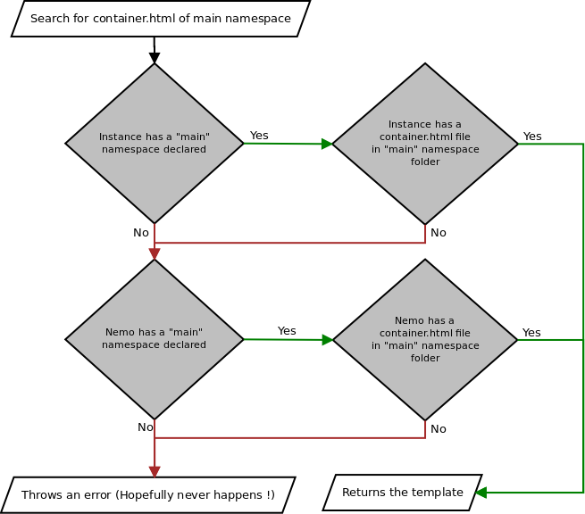
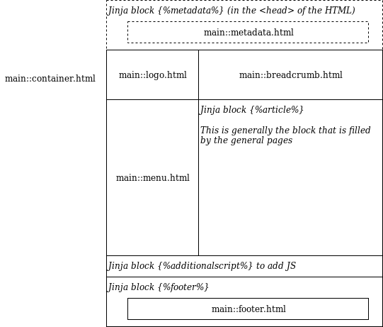

Modifying the templates
===

**Important:** If you want to do nice and powerful editions, we highly recommend that you learn the templating system of Flask (named Jinja2). The reference tutorial on Flask is the one from Miguel Grinberg, that you can support by buying for 15$ (~12.5€) [here](https://learn.miguelgrinberg.com/) or read from [his blog ](https://blog.miguelgrinberg.com/). The article about template is already [online](https://blog.miguelgrinberg.com/post/the-flask-mega-tutorial-part-ii-templates)

Let's say you are not really happy of the title of the application. And to be frank, the welcome page message is not really good for you regarding your funder. 

Well, we thought about you ! In the same manners than CSS/JS, it is possible to modify, add or completely replace the templates in Nemo. Let's start with editing.

## Editing a template

Templates are documented in the [Nemo Documentation](http://flask-capitains-nemo.readthedocs.io/en/latest/Nemo.templates.html#nemo-default-templates). But when it comes to editing a template,
I'd largely recommend to 

1. Copy the original template from [the original source](https://github.com/Capitains/flask-capitains-nemo/tree/master/flask_nemo/data/templates)
2. Edit the copied template
3. Set-up Nemo to use the edited template.

### Write the template

Let's see how it goes for the header. The original header is already contained in the main [`container.html`](https://github.com/Capitains/flask-capitains-nemo/blob/master/flask_nemo/data/templates/container.html) :

```html
<!DOCTYPE html>
<html lang="en">
  <head>
    <meta charset="utf-8">
    <meta http-equiv="X-UA-Compatible" content="IE=edge">
    <meta name="viewport" content="width=device-width, initial-scale=1">
    <!-- The above 3 meta tags *must* come first in the head; any other head content must come *after* these tags -->
    <title>Capitains Nemo</title>
    
      
    

    <!-- Bootstrap --><!-- Latest compiled and minified CSS -->
    <!--<link rel="stylesheet" href="{{url_for('.static', filename='css/teibp.min.css')}}">-->
    <link rel="stylesheet" href="https://maxcdn.bootstrapcdn.com/bootstrap/3.3.5/css/bootstrap.min.css">
    <link rel="stylesheet" href="{{url_for('.static', filename='css/theme.min.css')}}">
    
      <link rel="stylesheet" href="{{url_for('.secondary_assets', filetype='css', asset=filename)}}">
      <link rel="stylesheet" href="{{ filename }}">
      
    
    <!-- HTML5 shim and Respond.js for IE8 support of HTML5 elements and media queries -->
    <!-- WARNING: Respond.js doesn't work if you view the page via file:// -->
    <!--[if lt IE 9]>
      <script src="https://oss.maxcdn.com/html5shiv/3.7.2/html5shiv.min.js"></script>
      <script src="https://oss.maxcdn.com/respond/1.4.2/respond.min.js"></script>
    <![endif]-->
  </head>
  ...
```

Because we are working on our specific corpora, we are gonna change the title line and add some `<meta/>` tags

```html
<!DOCTYPE html>
<html lang="en">
  <head>
    <meta charset="utf-8">
    <meta http-equiv="X-UA-Compatible" content="IE=edge">
    <meta name="viewport" content="width=device-width, initial-scale=1">
    <!-- The above 3 meta tags *must* come first in the head; any other head content must come *after* these tags -->
    <meta name="description" content="Simple classical Latin texts made available in the Capitains Format">
    <meta name="keywords" content="XML,TEI,Capitains,Priapeia,latin,classical,classics">
    <meta name="author" content="Thibault Clérice">
    <title>Lasciva Roma By Capitains</title>
```

We register the file in the directory `templates/main/` and name it `container.html` (See the result [here](templates/main/container.html)) (as we want to modify the template, we need to use the same name). 
Once it is done, we are gonna need to setup Nemo.

### Set-up Nemo

Nemo has a strong and maybe complicated system for its templates as it offers the ability to have namespaces. The simplification of the situation is the following : `one folder of templates == one namespace` and this allows some templates to have the same name but be in different namespaces (avoiding collision is always a good idea !). So in order to overwrite the template, we will provide Nemo with a new folder for its main namespace (named `main`). Nemo will look first in our folder then look in its own to find the file for the template. To make it simpler, here goes a *simplified* decision workflow :



So from there, the setting is quite simple : we have made a directory `templates/main` which will come override the `main` namespace of Nemo :

```python
nemo = Nemo(
    #...
    templates={"main": "templates/main"}
)
```

Go run your site and see how the header has changed !

#### Step 1 - app.py

```python
from flask import Flask
from capitains_nautilus.cts.resolver import NautilusCTSResolver
from capitains_nautilus.flask_ext import FlaskNautilus
from flask_nemo import Nemo


flask_app = Flask("Flask Application for Nemo")
resolver = NautilusCTSResolver(["corpora/additional-texts", "corpora/priapeia"])
resolver.parse()

nautilus_api = FlaskNautilus(prefix="/api", app=flask_app, resolver=resolver)
nemo = Nemo(
    name="InstanceNemo",
    app=flask_app,
    resolver=resolver,
    base_url="",
    css=["assets/css/theme.css"],
    js=["assets/js/empty.js"],
    statics=["assets/images/logo.jpeg"],
    transform={"default": "components/main.xsl"},
    templates={"main": "templates/main"}
)

if __name__ == "__main__":
    flask_app.run(debug=True)

```

### Main templates

Templates are preceded with their namespace name and two colons : `namespace::filename.html`

- `main::container.html` : the frame for the pages
- `main::index.html` : the homepage
- `main::collection.html` : contains the template used when browsing the collections of works
- `main::references.html` : contains the template used when browsing passages available of a text (the table of contents)
- `main::text.html` : contains the templates used when reading a passage. This one actually contains a sub-template, `main::passage_footer.html` that allows you to easily modify what's written under your text.

As for the `main::container.html` template, here is how it is built :



## The destructive yet more effective way : replacing all templates.

*If you're happy with what we saw and do not want to get much more technical, do not bother reading this part.*

See, the thing is, if you want to be really free, I'd recommend to replace all the templates yourself, reading each of them carefully.

The option up there is mostly good if you want to the kind of design that we introduced for Nemo. The conditions to check are :

- You need to have the page templates have the same name and namespace : `main::collection.html`, `main::references.html`, `main::text.html` and `main::index.html`. 
- After having make sure that you understood them, including their variables, write your owns. You cannot simply change the variable names

Once that's done, you can use the `template_folder` parameters at initiation. The value should be a string leading to a folder containing the templates for the namespace `main::`


```python
nemo = Nemo(
    # ...
    template_folder="templates/main"
)
```