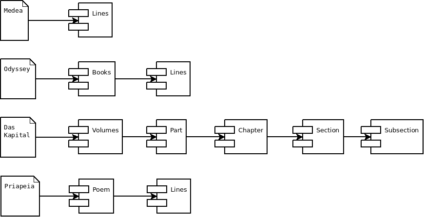
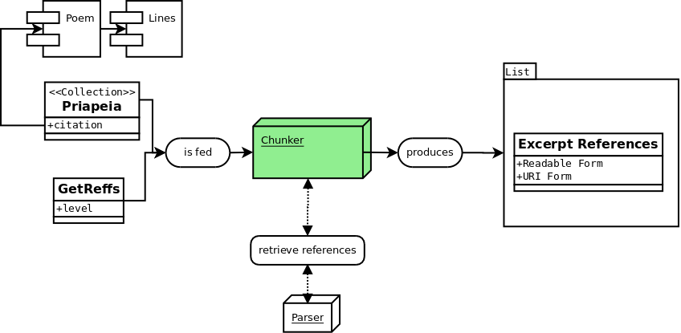

Editorializing your texts : cutting your text a better way
===

Nemo is a fit-them-all digital library system that unfortunately is quite stupid when it comes to how to present your text. Because Nemo should fit them all, it makes no assumption on how to present your text and will most likely behave in a way you won't like at all.

**But do not worry : it can be customized easily.**


## Chunkers 

The tools for cutting the text in Nemo are named Chunkers and they provide a simple yet efficient way to present your text in chunks of your choice, either manually or semi-automatically set. Isn't it nice ? 

To understand chunkers, we are gonna need to understand a little how Nemo works. When you set up Nemo, you give it a parser of texts, generally for local readable files such as the one we set up. Nemo does not know much about the text except the metadata it can get : the title, the structure of the text, and any other metadata you threw in. Unfortunately, it happens that it is not much for Nemo to decide. Here is four simple examples based on quite known texts : 



Nemo is only aware of that at the beginning. The way Nemo works is then simple : it feeds this information to a chunker that will automatically request available references to build the excerpts presented to the users.

### Default behaviour

By default, Nemo would be showing those texts by grouping them by 20 at their lowest level. So you would have :

- **for Medea** : Lines 1-20, Lines 21-40, Lines 41-60
- **for the Odyssey**: Book 1 Lines 1-20, Book 1 Lines 21-40, Book 1 Lines 41-60
- **for Das Kapital**: Volume 1 Part 1 Chapter 1 Section 1 Subsection 1-20.
- **for the Priapeia**: Poem 1 line 1-20, Poem 1 Lines 21-25, Poem 2 line 1-20 etc.

*Note that the default system would not span over lines if Poem 1 stops at line 25 !*

### Issues

This is great, except that :
- it might cut sentences in half (In fact, the Odyssey sentence on Book 1 Line 20 ends at Book 1 Line 21)
- it might not be meaningful : Medea is a play, dialogs are meant to be displayed together for the reader to grasp some sense. Scenes and act might be a better cutting scheme ?
- it might simply fails: Das Kapital does not have subsection everywhere in all chapter. So it might not show all of them...
- it might make the reading heavy : Priapeia are really short poems, it might be more meaningful to show them fully one by one.

## Let's build our own chunker for the Priapeia !

So the Priapeia would be better displayed as poems only. How do we achieve that ? 

### Structure of a Chunker

Well it's pretty simple. You see, Nemo Chunkers are simple python functions, whose skeleton is something like the following

```python
def nemo_chunker(text, getreffs):
    """ This is the default chunker which will resolve the reference giving a callback (getreffs) and a text object with its metadata

    :param text: Readable Collection that has a .citation attribute
    :param getreffs: Callback function which retrieves a list of references
    :return: List of passage as tuple such that the first member is a URI version and the second the human one 
    			("1.1-1.20", "Book 1 Line 1-20")
    """
```

The Nemo Chunker is always feed these two informations. The GetReffs function is a function such that you can :
- run `getreffs(level=1)` and get all reference at the level 1 (For the Priapeia, all poems)
- run `getreffs(level=2)` and get all reference at the level 2 (For the Priapeia, all lines accros Poems)
- run `getreffs(level=len(text.citation))` and get all reference at the deepest level of citation (For the Priapeia, level 2 : lines)



### The simple hard-coded chunker 

Our Priapeia are numbered from 1 to 79 so we could probably do a simple function such as : 

```python
def priapeia_chunker(text, getreffs):
    # We build a list of the number
    poems = []
    for poem_number in range(1, 80):  # Range in Python stops before its end limit
        poems.append(
            (  # Tuple are written with a () in python
                str(poem_number),                   # First the reference for the URI as string
                "Priapeia "+ str(poem_number)  # Then the readable format for humans
            )
        )
    return poems
```

### Feeding the chunker to Nemo

Great. Should works. To affect a chunker to a specific text, Nemo does the same way that it does for XSL (See *[Playing with the JavaScript, the CSS, the statics and the XSLTs](2-playing-with-js-css-xslt.md)*), using a dictionnary :


#### Step 1 - app.py

```python
from flask import Flask
from capitains_nautilus.cts.resolver import NautilusCTSResolver
from capitains_nautilus.flask_ext import FlaskNautilus
from flask_nemo import Nemo


def priapeia_chunker(text, getreffs):
    # We build a list of the number
    poems = []
    for poem_number in range(1, 80):  # Range in Python stops before its end limit
        poems.append(
            (  # Tuple are written with a () in python
                str(poem_number),                   # First the reference for the URI as string
                "Priapeia "+ str(poem_number)  # Then the readable format for humans
            )
        )
    return poems


flask_app = Flask("Flask Application for Nemo")
resolver = NautilusCTSResolver(["corpora/additional-texts", "corpora/priapeia"])
resolver.parse()

nautilus_api = FlaskNautilus(prefix="/api", app=flask_app, resolver=resolver)
nemo = Nemo(
    name="InstanceNemo",
    app=flask_app,
    resolver=resolver,
    base_url="",
    css=["assets/css/theme.css"],
    js=["assets/js/empty.js"],
    statics=["assets/images/logo.jpeg"],
    transform={"default": "components/main.xsl"},
    templates={"main": "templates/main"},
    chunker={"urn:cts:latinLit:phi1103.phi001.lascivaroma-lat1": priapeia_chunker}
)
```

### The larger, automatic chunker

### When should you choose one against the other

Plays or heavily thought presentation should prefer the first one (hardcoded)

More generic, automatic corpora (or simple one such as poems, letters, etc.) should prefer the secon