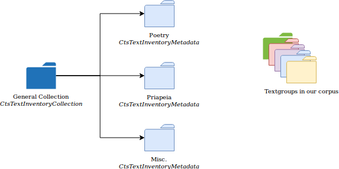
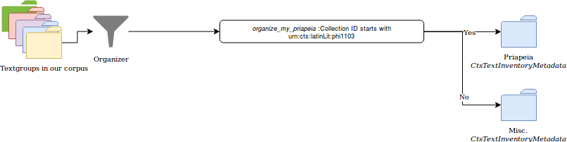
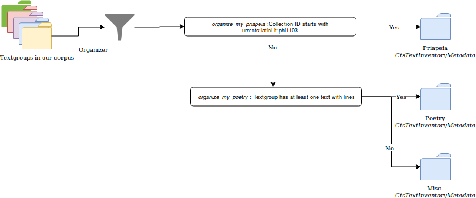

Editorializing Your Texts : building virtual collections to arrange your texts
===

We have seen up to now ways to make each individual text look better, either through XSL and styling or through the use of chunkers. The next step will look at how to make browsing of your own collections a little more interesting.

The way Capitains collections are built behind the scenes by our resolver is quite simple : it glues all the textgroup it finds into one super-massive collection named "Default Collection". And let's be honest, that's in no way a good thing to display (I can only imagine a user of the site looking at the menu right, with one link, "default collection". There might be some raised eyebrows).

## So, you said Virtual Collections

Virtual Collections are really simply what they are named : collections that are not covered by your files but are built at run time by Nemo or Nautilus.

Virtual collections are built through the use of MyCapytain TextInventoryCollection's object. In CTS, there is a structure of data which is meant to be TextInventory > Textgroup > Work > Edition or Translation but there was not a Collection of TextInventories. So here you go :

```python
from MyCapytain.resources.prototypes.cts.inventory import CtsTextInventoryCollection, CtsTextInventoryMetadata
```

Once we have imported that, we can build our TextInventories's Collection :

```python
general_collection = CtsTextInventoryCollection()
```

We have three rough kind of texts in our collections :
- Poetry
- Priapeia
- And Miscellaneous

Obviously, we could go deeper but it feels to be good enough. We will then create 3 TextInventories covering these 3 entry points. For each of these TextInventories, we will :
- create an identifier (it can be fully internal)
- connect it to the general collection we created earlier

```python

poetry = CtsTextInventoryMetadata("poetry_collection", parent=general_collection)
poetry.set_label("Poetry", "eng")
poetry.set_label("Poésie", "fre")

priapeia = CtsTextInventoryMetadata("priapeia_collection", parent=general_collection)
priapeia.set_label("Priapeia", "eng")
priapeia.set_label("Priapées", "fre")

misc = CtsTextInventoryMetadata("id:misc", parent=general_collection)
misc.set_label("Miscellaneous", "eng")
misc.set_label("Textes Divers", "fre")
```

Have you seen ? Once we have an inventory, we can actually give it labels in different languages using ISO codes (fre for French, eng for English, ger for German, etc.). The identifier we have used is completely free : the only character you can't use is `/`. We could have had things such as `CtsTextInventoryMetadata("urn:myproject:poetry", parent=general_collection)` as long as it makes sense to you.

We know have something that look likes that : a main collection, three subcollections to display, and a set of textgroups that need to be organized :



## Feeding the texts to virtual collections

To dispatch text automatically, MyCapytain proposes a `CollectionDispatcher`. The idea is simple : you link the dispatcher to your main collection, and you create function that is gonna organize your text depending on their metadata. 

Let's start by setting up this dispatcher :

```python
organizer = CollectionDispatcher(general_collection, default_inventory_name="id:misc")
```

We connected it to our main collection, and we said "When you don't know where it should go, put it in the miscellaneous collection" identified by `id:misc`.

And then we are gonna want to organize our texts. Let's see, the simplest situation might be the Priapeia : it's one textgroup, it'll be easy to recognize it. 

```python
@organizer.inventory("priapeia_collection")
def organize_my_priapeia(collection, path=None, **kwargs):
    if collection.id.startswith("urn:cts:latinLit:phi1103"):
        return True
    return False
```

Let's see what we did :

- We preceded a function with `@organizer.inventory("priapeia_collection")` which reuse our `organizer` variable and the id of our `priapeia` collection.
- we wrote a function taking by default a `collection`, a `path` and that can take many more parameters (`**kwargs` is kind of a joker that means : give me every parameter you want, I'll accept them !)
    - If this function returns True, the textgroup that it gets fed is stored in the collection we gave the id.

That means that, when the `Dispatcher` meets a textgroup, it will run this function, if this function returns True, it will store it :



Because we are looking for poems, the metadata at the textgroup level won't be enough. Textgroups are composed of works which are themselves embodied by realization such as editions and translations. Here, what we will do is check that the citation scheme of the other textgroups have at least one edition that has a poem. The function might be a little more complicated :


```python
@organizer.inventory("poetry_collection")
def organize_my_poetry(collection, path=None, **kwargs):
    # If we are not dealing with Priapeia
    if not collection.id.startswith("urn:cts:latinLit:phi1103"):
        # Textgroups have a wonderful shortcut to their editions and translations : .readableDescendants
        for text in collection.readableDescendants:
            for citation in text.citation:
                if citation.name == "line":
                    return True
    return False
```

- We check that the text is not the Priapeia, which also has line in its citation scheme.
- We loop over each of its editions, commentary and translations.
    - In the citation scheme, if the text has poetry in it, we return `True.`




## Connecting everything

Now that we have done all our set-up, the next thing is connecting. It's actually quite simple : we need to put first our dispatchers and collections, and then give `dispatcher=organizer` to the Nautilus Resolver :

### app.py

```python
from flask import Flask


from MyCapytain.resources.prototypes.cts.inventory import CtsTextInventoryCollection, CtsTextInventoryMetadata
from MyCapytain.resolvers.utils import CollectionDispatcher


from capitains_nautilus.cts.resolver import NautilusCTSResolver
from capitains_nautilus.flask_ext import FlaskNautilus
from flask_nemo.chunker import level_grouper
from flask_nemo import Nemo


def get_citation_scheme(text):
    # We create an empty list to store citations level names
    citation_types = []
    #  We loop over the citation scheme of the Text
    for citation in text.citation:
        # We append the name of the citation level in the list we created
        citation_types.append(citation.name)
    # At this point, we just return
    return citation_types


def generic_chunker(text, getreffs):
    # We build the citation type
    citation_types = get_citation_scheme(text)
    if "poem" in citation_types:
        level = citation_types.index("poem") + 1
        level_name = "Poem"
        excerpt_length = 1
    else:
        level = len(citation_types)
        level_name = citation_types[-1]
        excerpt_length = 20

    if excerpt_length > 1:
        reffs = level_grouper(text, getreffs, level, excerpt_length)
    else:
        reffs = getreffs(level=level)
        reffs = [(reff, level_name + " " + reff) for reff in reffs]

    return reffs


# Setting up the collections

general_collection = CtsTextInventoryCollection()
poetry = CtsTextInventoryMetadata("poetry_collection", parent=general_collection)
poetry.set_label("Poetry", "eng")
poetry.set_label("Poésie", "fre")

priapeia = CtsTextInventoryMetadata("priapeia_collection", parent=general_collection)
priapeia.set_label("Priapeia", "eng")
priapeia.set_label("Priapées", "fre")

misc = CtsTextInventoryMetadata("id:misc", parent=general_collection)
misc.set_label("Miscellaneous", "eng")
misc.set_label("Textes Divers", "fre")
organizer = CollectionDispatcher(general_collection, default_inventory_name="id:misc")


@organizer.inventory("priapeia_collection")
def organize_my_priapeia(collection, path=None, **kwargs):
    if collection.id.startswith("urn:cts:latinLit:phi1103"):
        return True
    return False


@organizer.inventory("poetry_collection")
def organize_my_poetry(collection, path=None, **kwargs):
    # If we are not dealing with Priapeia
    if not collection.id.startswith("urn:cts:latinLit:phi1103"):
        # Textgroups have a wonderful shortcut to their editions and translations : .readableDescendants
        for text in collection.readableDescendants:
            for citation in text.citation:
                if citation.name == "line":
                    return True
    return False


# Parsing the data
resolver = NautilusCTSResolver(["corpora/additional-texts", "corpora/priapeia"], dispatcher=organizer)
resolver.parse()


flask_app = Flask("Flask Application for Nemo")
nautilus_api = FlaskNautilus(prefix="/api", app=flask_app, resolver=resolver)
nemo = Nemo(
    name="InstanceNemo",
    app=flask_app,
    resolver=resolver,
    base_url="",
    css=["assets/css/theme.css"],
    js=["assets/js/empty.js"],
    statics=["assets/images/logo.jpeg"],
    transform={"default": "components/main.xsl"},
    templates={"main": "templates/main"},
    chunker={"default": generic_chunker}
)

if __name__ == "__main__":
    flask_app.run(debug=True)

```

## Next

Want to put this online ? Let's [set up a Heroku Server !](6-setting-up-heroku.md)