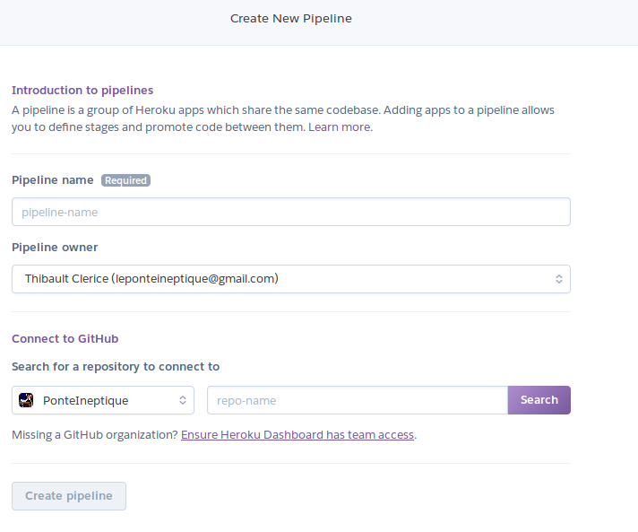
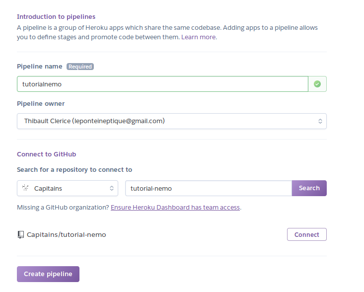
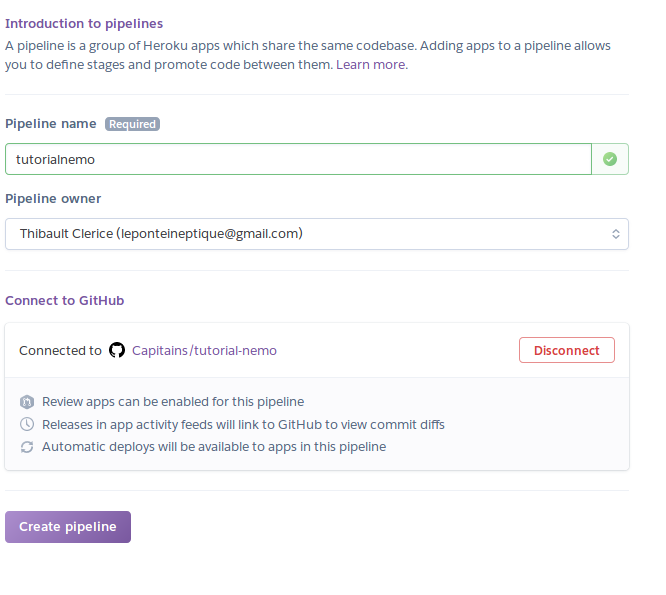
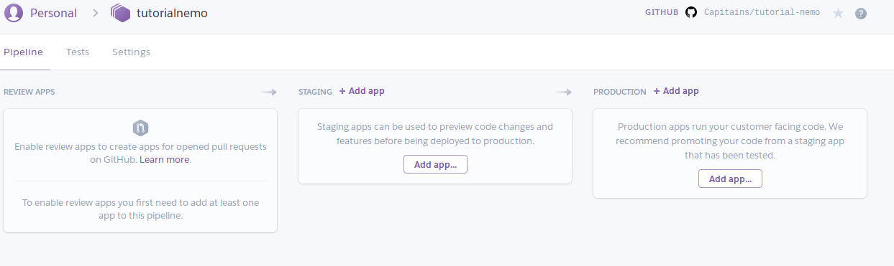
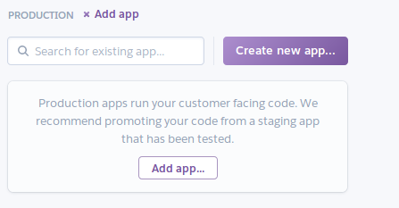
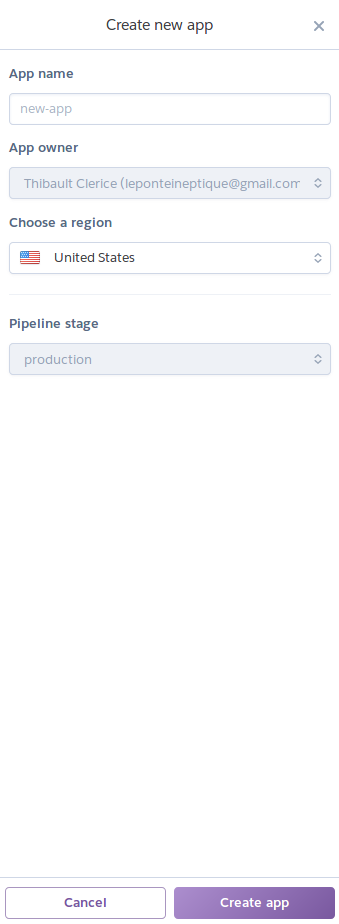
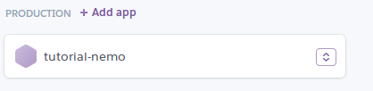
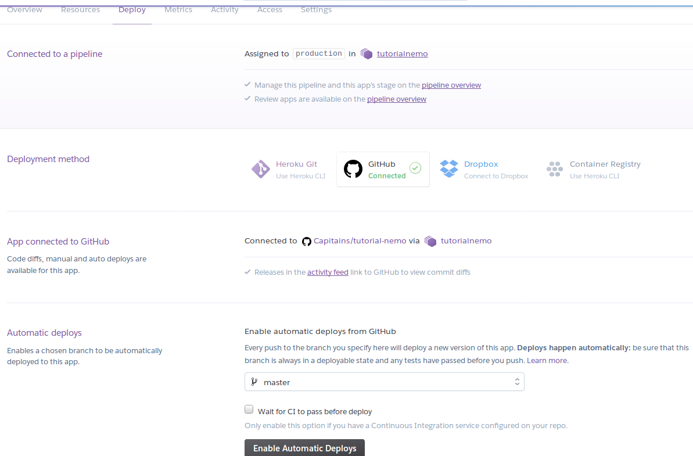
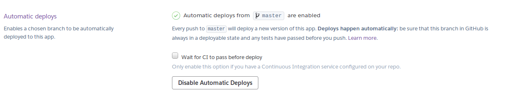

Time to put online ! Example with Heroku and Documentations for others
===

> Heroku is a cloud platform as a service (PaaS) supporting several programming languages that is used as a web application deployment model. Heroku, one of the first cloud platforms, has been in development since June 2007, when it supported only the Ruby programming language, but now supports Java, Node.js, Scala, Clojure, Python, PHP, and Go. For this reason, Heroku is said to be a polyglot platform as it lets the developer build, run and scale applications in a similar manner across all the languages. Heroku was acquired by Salesforce.com in 2010 for $212 million.
> https://en.wikipedia.org/wiki/Heroku

## Requirements

- You will need a github account and have put your code in a github repository
- You will need a Heroku account : https://signup.heroku.com/

## Set-up

First, sign-in onto your account on Heroku. 

### Create a pipeline

You should broadly have something like the following picture :

[Screen upon connection on Heroku](./images-for-md/heroku.new.png)

- Click on `New` > `New Pipeline`.

#### Set up the pipeline

You are now on a "Create a new Pipeline" page. 



On this page :
- fill the pipeline name with a name you'll be able to recognize easily
- Select your account under github and make sure to search for the right repository
    - Click on Connect when the repository appears



And after Connect has been pressed 



Hit `Create Pipeline` and let's go to the next page !

### Create an app

You should be on your dashboard : 



Under `Production`, click `Add App`. A small double choice pops-up :



Hit `Create new app...` and a new menu appears on your right :



Fill the app-name and with a sensible name (here `tutorial-nemo`) choose carefully the region (I'll choose Europe on my end) then click `Create app`. A new thing appears under Production :



Click on the name of your app. 

On the new page, you'll find a link `Deploy` on which you can click to make the following tab appear : 



Simply click on Automatic Deploys and you're all set on the side of Heroku's website ! 



You should be able to click on `Open App` on the top right corner of the page. For this project, it would be https://tutorial-nemo.herokuapp.com/

## But, it does not work !


No, it does not. Because what we did was merely telling to Heroku "Hey, I got this app, can you host it" but we did not tell it how to run the app. Though, it's fairly easy : we need to add two new files to our github repository : `runtime.txt` and `Procfile`. Let's see the content of these files.

### `runtime.txt`

The runtime file only includes the version of python you want to use, so the file is quite simple : 

```text
python-3.6.4
```


### `Procfile`

**Careful**, `Procfile` has no extension. The Procfile is simply telling Heroku which command should run the app. Fairly simple !

```Procfile
web: gunicorn app:flask_app
```

What we said here is : for the web, please run `gunicorn` over `#app.py` where you'll find the `flask_app` variable. You can simply again copy and paste.

### `requirements.txt`

Because we are now using a server named gunicorn and that it's python based, do not forget to add `gunicorn` to your requirements.txt : 

```text
flask-nemo==1.0.1
capitains_nautilus==1.0.2
# For heroku
gunicorn
```

And you're all set. Add everything, commit and go back to your app link : it works !

### Note

Because Heroku is a free service, it has some limits. We recommend removing from the test data the folder `stoa0289`, `stoa0213c` and `stoa0159`